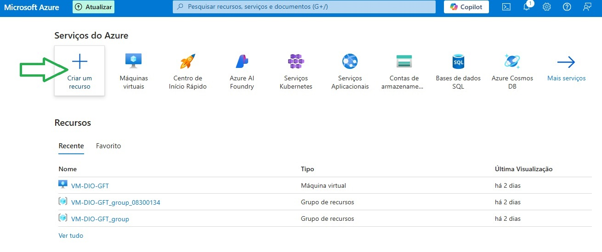
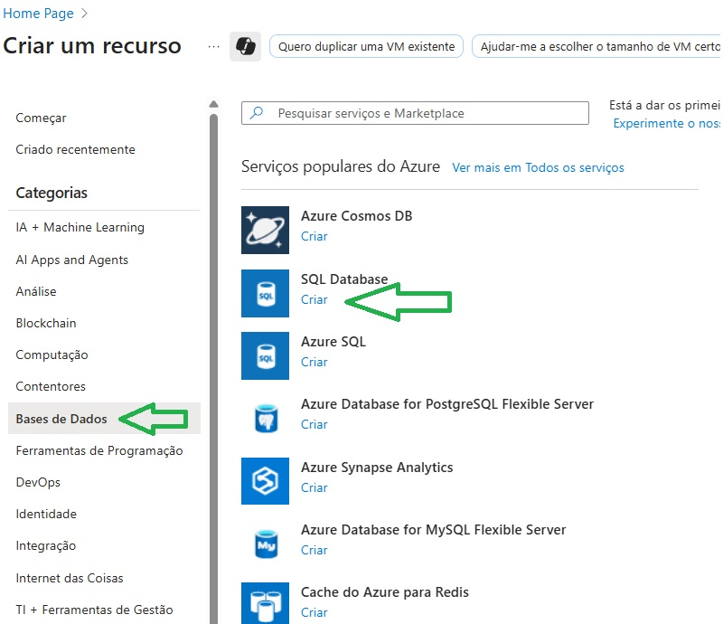
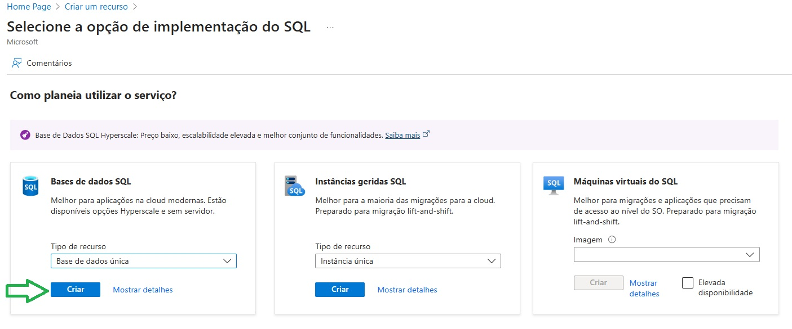
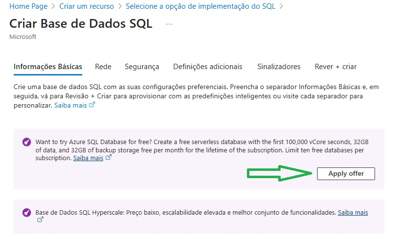
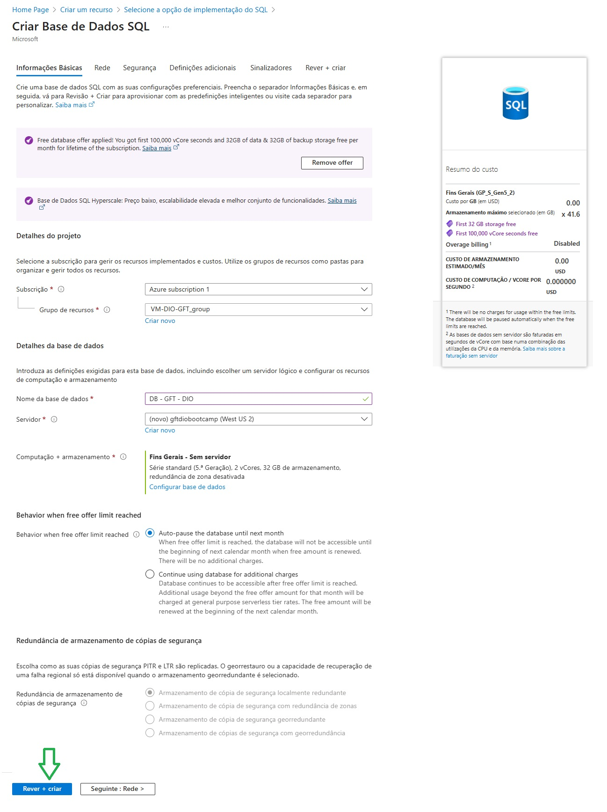
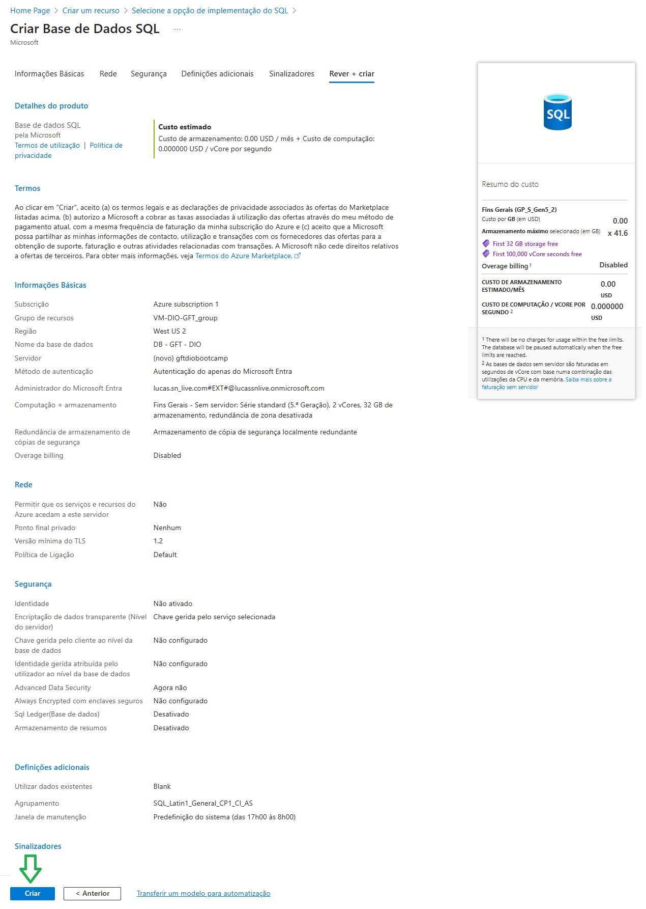
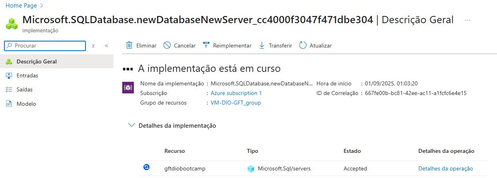

# Criação de uma Instância de Banco de Dados SQL no Microsoft Azure

Este documento descreve o passo a passo ao qual realizei para criar uma instância de Banco de Dados SQL na plataforma Microsoft Azure.

O objetivo é mostrar como utilizar a opção gratuita e configurar rapidamente um banco de dados na nuvem.

---

## 1. Acessando o portal Azure
Primeiro, entre no [portal do Azure](https://portal.azure.com/) com sua conta.  
Caso ainda não possua uma, é possível criar gratuitamente em:  
https://azure.microsoft.com/free/

---

## 2. Criar um novo recurso
No painel inicial do Azure, clique em **"Criar um recurso"**.

---

## 3. Selecionar SQL Database
No menu lateral, escolha **"Bases de Dados"** e, em seguida, clique em **"SQL Database"** para criar um novo banco.

Essa opção é ideal para aplicações modernas na nuvem, pois oferece escalabilidade e administração simplificada.

---

## 4. Escolher a opção de implementação
Na tela seguinte, selecione **"Bases de dados SQL"** e clique em **Criar**.  
Essa modalidade é a mais indicada para quem deseja apenas um banco de dados gerenciado, sem precisar lidar com configurações complexas de instâncias ou máquinas virtuais.

---

## 5. Ativar a oferta gratuita
Clique em **"Apply offer"** para ativar o benefício do plano gratuito.  
Esse plano inclui até **100.000 segundos vCore**, **32 GB de armazenamento** e **32 GB de backup**, suficientes para estudos e projetos iniciais.

---

## 6. Preencher as configurações básicas
Configure as informações do projeto

Depois de preencher, clique em **"Rever + criar"**.

---

## 7. Revisar informações
Verifique todos os detalhes configurados, como região, grupo de recursos e políticas de segurança.  
Se estiver tudo correto, clique em **"Criar"**.

---

## 8. Implementação em andamento
O recurso agora está disponível no seu grupo de recursos para ser utilizado.

---

Seguindo esses passos, você poderá ter um **Banco de Dados SQL no Azure**
